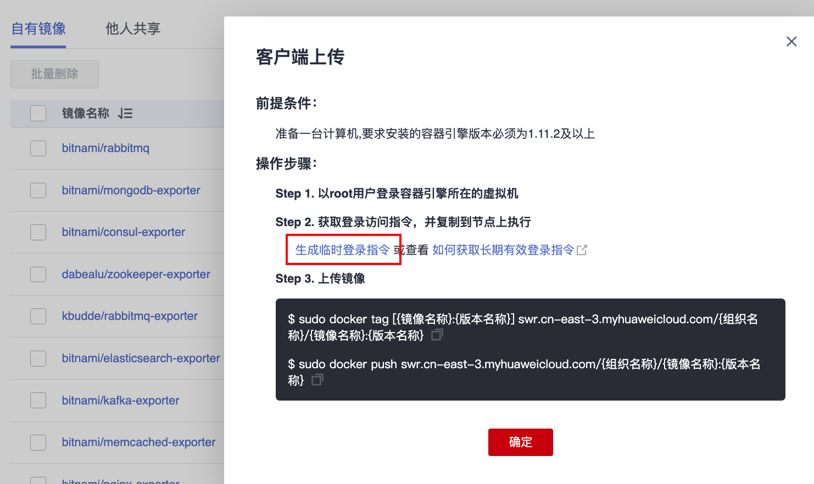

## 构建nginx
```bash
docker build -t new-nginx:v1 .
```

## SWR操作
### 登录

### 上传镜像
```bash
$ sudo docker tag new-nginx:v1 swr.cn-east-3.myhuaweicloud.com/aom-org/new-nginx:v1
$ sudo docker push swr.cn-east-3.myhuaweicloud.com/aom-org/new-nginx:v1
```

## CCE部署

